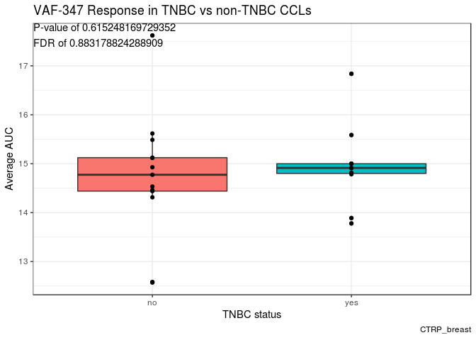
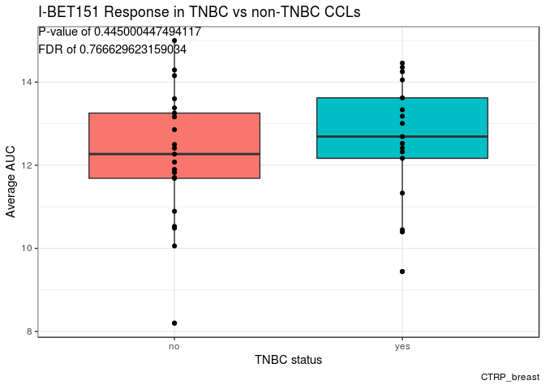
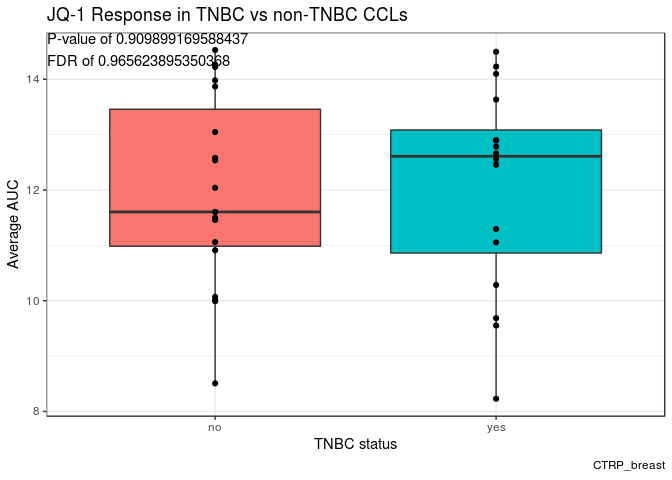
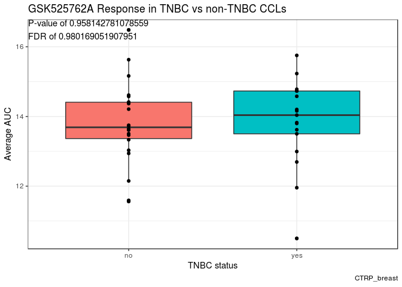
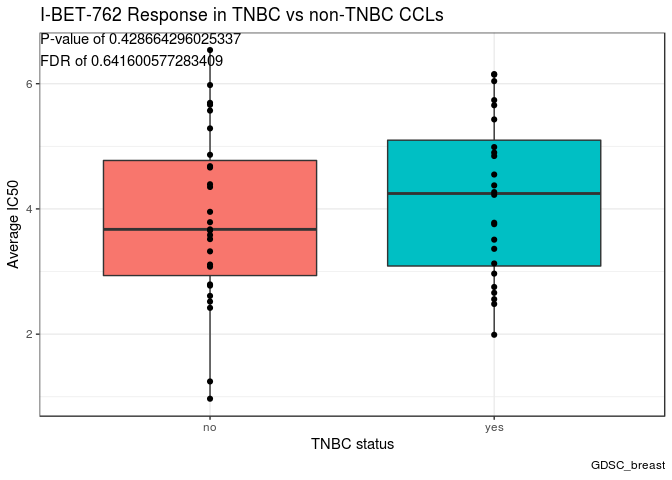
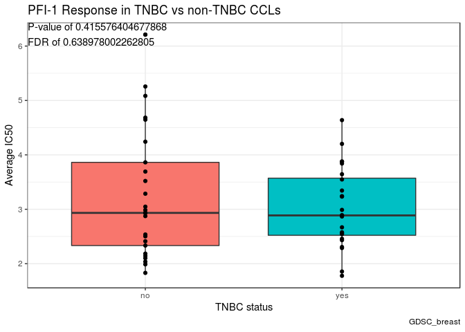
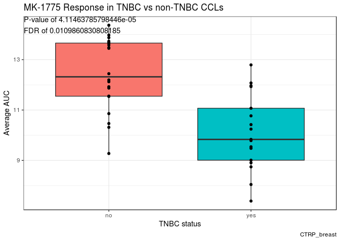
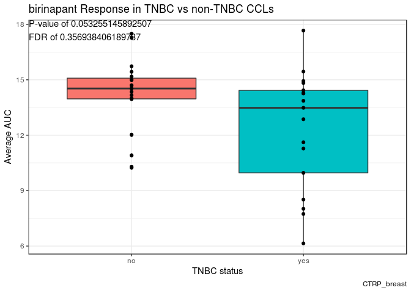

Cell Line Drug Response Analysis
================
Robert Gruener
November 4, 2018

### Let's Do Some Cancer Biology

Here, we are going to be using some data to see how cancer cell lines respond to various drug treatments.

Let's Get the Data
------------------

The data that I'll be using is originally from [GDSC](https://www.cancerrxgene.org/) and [CTRP](https://portals.broadinstitute.org/ctrp.v2.1/), but I placed files that were slightly modified already in the repo.

The first cell line info page was from [cellosaurus](https://web.expasy.org/cellosaurus/), the second breast cancer cell line info is from [a recent review](http://www.jcancer.org/v08p3131.htm) and shows the molecular classifications of the breast cancer cell lines. These files are also in the repo.

Shown below is some of the information these data files contain.

    ## [1] "GDSC"

    ## # A tibble: 224,510 x 18
    ##       X1 Drug_CCL Drug.name Drug.Id Cell.line.name Cosmic.sample.Id
    ##    <int> <chr>    <chr>       <int> <chr>                     <int>
    ##  1     1 17-AAG:… 17-AAG       1026 201T                    1287381
    ##  2     2 17-AAG:… 17-AAG       1026 22RV1                    924100
    ##  3     3 17-AAG:… 17-AAG       1026 23132-87                 910924
    ##  4     4 17-AAG:… 17-AAG       1026 42-MG-BA                 687561
    ##  5     5 17-AAG:… 17-AAG       1026 451Lu                   1287706
    ##  6     6 17-AAG:… 17-AAG       1026 5637                     687452
    ##  7     7 17-AAG:… 17-AAG       1026 639-V                    906798
    ##  8     8 17-AAG:… 17-AAG       1026 647-V                    906797
    ##  9     9 17-AAG:… 17-AAG       1026 697                      906800
    ## 10    10 17-AAG:… 17-AAG       1026 786-0                    905947
    ## # ... with 224,500 more rows, and 12 more variables:
    ## #   TCGA.classification <chr>, Tissue <chr>, Tissue.sub.type <chr>,
    ## #   IC50 <dbl>, AUC <dbl>, Max.conc <int>, RMSE <dbl>, Z.score <dbl>,
    ## #   Dataset.version <int>, Avg.IC50 <dbl>, Duplicated <chr>,
    ## #   Avg.IC50.dups <chr>

    ## [1] "CTRP"

    ## # A tibble: 395,263 x 23
    ##       X1 experiment_id conc_pts_fit fit_num_param p1_conf_int_high
    ##    <int>         <int>        <int>         <int>            <dbl>
    ##  1     1             1           16             3         -2.85e 5
    ##  2     2             1           16             3         -1.22e 4
    ##  3     3             1           16             3       -Inf      
    ##  4     4             1           11             3         -2.24e 5
    ##  5     5             1           16             3          3.03e 0
    ##  6     6             1           16             2          4.34e 0
    ##  7     7             1            8             2         -2.96e 5
    ##  8     8             1           11             3         -6.02e 4
    ##  9     9             1           11             3         -1.65e14
    ## 10    10             1           11             3         -5.54e 0
    ## # ... with 395,253 more rows, and 18 more variables:
    ## #   p1_conf_int_low <dbl>, p2_conf_int_high <dbl>, p2_conf_int_low <dbl>,
    ## #   p4_conf_int_high <dbl>, p4_conf_int_low <dbl>, p1_center <dbl>,
    ## #   p2_slope <dbl>, p3_total_decline <dbl>, p4_baseline <dbl>,
    ## #   apparent_ec50_umol <dbl>, pred_pv_high_conc <dbl>,
    ## #   area_under_curve <dbl>, master_cpd_id <int>, CCL_Name <chr>,
    ## #   Cellosaurus_Id <chr>, cpd_name <chr>, CCL_Drug <chr>, Avg_AUC <dbl>

    ## [1] "Cell Line Info"

    ## # A tibble: 5,655 x 16
    ##    Pick  Cell_Line_Name Dataset Tissue Condensed_Cance… Short_Condensed…
    ##    <chr> <chr>          <chr>   <chr>  <chr>            <chr>           
    ##  1 CVCL… PECAPJ34CLONE… Achill… aerod… aerodigestive t… aerodigestive t…
    ##  2 CVCL… 697            CCLE    haema… haematopoietic/… haematopoietic/…
    ##  3 CVCL… PECAPJ34CLONE… CTRPv2  aerod… aerodigestive t… aerodigestive t…
    ##  4 CVCL… Ca9-22         GDSC    aerod… aerodigestive t… aerodigestive t…
    ##  5 CVCL… BHY            Achill… aerod… aerodigestive t… aerodigestive t…
    ##  6 CVCL… YD38           Achill… aerod… aerodigestive t… aerodigestive t…
    ##  7 CVCL… 5637           CCLE    bladd… bladder cancer   other cancer    
    ##  8 CVCL… 1321N1         CCLE    nervo… nervous system … nervous system …
    ##  9 CVCL… BHY            CTRPv2  aerod… aerodigestive t… aerodigestive t…
    ## 10 CVCL… YD38           CTRPv2  aerod… aerodigestive t… aerodigestive t…
    ## # ... with 5,645 more rows, and 10 more variables: Diseases <chr>,
    ## #   Ethnicity <chr>, Simple_Ethnicity <chr>, Age_years <chr>,
    ## #   Gender <chr>, GDSC_Drug_Data <chr>, Names <chr>, BioSampleID <chr>,
    ## #   Duplicated_within_study <chr>, CCLE_Drug_Data <chr>

    ## [1] "Breast cancer cell line info"

    ## # A tibble: 85 x 11
    ##    `Cell lines` ER    PR    HER2  `BRCA1\nMutatio… Subtype Series
    ##    <chr>        <chr> <chr> <chr> <chr>            <chr>   <chr> 
    ##  1 "Mutation\"" Subt… Seri… Basi… Tumor            Source  Refer…
    ##  2 BT483        +     +/-   -     WT               LA      BT    
    ##  3 CAMA1        +     +/-   -     WT               LA      <NA>  
    ##  4 EFM19        +     +     -     ND               LA      EFM   
    ##  5 HCC1428      +     +     -     ND               LA      HCC   
    ##  6 HCC712       +     +/-   -     ND               LA      HCC   
    ##  7 IBEP2        +     -     -     ND               LA      <NA>  
    ##  8 KPL1         +     -     -     ND               LA      <NA>  
    ##  9 LY2          +     -     -     ND               LA      <NA>  
    ## 10 MCF7         +     +     -     WT               LA      MCF   
    ## # ... with 75 more rows, and 4 more variables: `Basic Medium` <chr>,
    ## #   Tumor <chr>, Source <chr>, References <chr>

Cleaning and Subsetting the data
--------------------------------

We now need to combine the info files with the drug data, and subset to just the breast cancer cell lines

Here is how the data looks once cleaned

``` r
GDSC_breast
```

    ## # A tibble: 11,199 x 16
    ##    Drug.name Drug.Id Cell.line.name Tissue Avg.IC50 CCL_Name ER    PR   
    ##    <chr>       <int> <chr>          <chr>     <dbl> <chr>    <chr> <chr>
    ##  1 17-AAG       1026 AU565          breast   -2.24  AU565    -     -    
    ##  2 17-AAG       1026 BT-20          breast   -0.867 BT20     -     -    
    ##  3 17-AAG       1026 BT-474         breast   -3.32  BT474    +     +    
    ##  4 17-AAG       1026 BT-483         breast    0.357 BT483    +     +/-  
    ##  5 17-AAG       1026 BT-549         breast   -1.86  BT549    -     -    
    ##  6 17-AAG       1026 CAL-120        breast   -0.506 CAL120   -     -    
    ##  7 17-AAG       1026 CAL-51         breast   -3.71  CAL51    -     -    
    ##  8 17-AAG       1026 CAL-85-1       breast    2.51  CAL851   -     -    
    ##  9 17-AAG       1026 COLO-824       breast   -1.97  COLO824  <NA>  <NA> 
    ## 10 17-AAG       1026 DU-4475        breast   -1.50  DU4475   -     -    
    ## # ... with 11,189 more rows, and 8 more variables: HER2 <chr>,
    ## #   `BRCA1\nMutation` <chr>, Subtype <chr>, Series <chr>, `Basic
    ## #   Medium` <chr>, Tumor <chr>, Source <chr>, References <chr>

``` r
CTRP_breast
```

    ## # A tibble: 82,241 x 15
    ##    CCL_Name Tissue Cellosaurus_Id cpd_name Avg_AUC ER    PR    HER2 
    ##    <chr>    <chr>  <chr>          <chr>      <dbl> <chr> <chr> <chr>
    ##  1 KPL1     breast CVCL_2094      CIL55       15.7 +     -     -    
    ##  2 KPL1     breast CVCL_2094      CIL55       15.7 +     -     -    
    ##  3 KPL1     breast CVCL_2094      BRD4132     16.9 +     -     -    
    ##  4 KPL1     breast CVCL_2094      BRD4132     16.9 +     -     -    
    ##  5 KPL1     breast CVCL_2094      BRD6340     15.9 +     -     -    
    ##  6 KPL1     breast CVCL_2094      BRD6340     15.9 +     -     -    
    ##  7 KPL1     breast CVCL_2094      ML006       14.2 +     -     -    
    ##  8 KPL1     breast CVCL_2094      ML006       14.2 +     -     -    
    ##  9 KPL1     breast CVCL_2094      Bax cha…    12.6 +     -     -    
    ## 10 KPL1     breast CVCL_2094      Bax cha…    12.6 +     -     -    
    ## # ... with 82,231 more rows, and 7 more variables:
    ## #   `BRCA1\nMutation` <chr>, Subtype <chr>, Series <chr>, `Basic
    ## #   Medium` <chr>, Tumor <chr>, Source <chr>, References <chr>

Unfortunately, there is likely some missing subtype information still. Let's see:

| CCL\_Name | Subtype |
|:----------|:--------|
| HDQP1     | NA      |
| JIMT1     | NA      |
| HMC18     | NA      |
| HCC1500   | NA      |
| HS578T    | NA      |
| HCC1419   | NA      |
| COLO824   | NA      |
| EVSAT     | NA      |
| MRKnu1    | NA      |
| OCUBM     | NA      |
| YMB1E     | NA      |
| MB157     | NA      |

Those 12 values will be manually curated. The top 10 rows of the final cleaned up data frame without any missing NA values and with the relevant columns selected is displayed below for GDSC and CTRP respectively:

    ## # A tibble: 11,199 x 4
    ##    cpd_name CCL_Name Subtype Avg_IC50
    ##    <chr>    <chr>    <chr>      <dbl>
    ##  1 17-AAG   AU565    H         -2.24 
    ##  2 17-AAG   BT20     TNA       -0.867
    ##  3 17-AAG   BT474    LB        -3.32 
    ##  4 17-AAG   BT483    LA         0.357
    ##  5 17-AAG   BT549    TNB       -1.86 
    ##  6 17-AAG   CAL120   TNB       -0.506
    ##  7 17-AAG   CAL51    TNB       -3.71 
    ##  8 17-AAG   CAL851   TNB        2.51 
    ##  9 17-AAG   COLO824  TN        -1.97 
    ## 10 17-AAG   DU4475   TNA       -1.50 
    ## # ... with 11,189 more rows

    ## # A tibble: 16,842 x 4
    ##    cpd_name            CCL_Name Subtype Avg_AUC
    ##    <chr>               <chr>    <chr>     <dbl>
    ##  1 CIL55               KPL1     LA         15.7
    ##  2 BRD4132             KPL1     LA         16.9
    ##  3 BRD6340             KPL1     LA         15.9
    ##  4 ML006               KPL1     LA         14.2
    ##  5 Bax channel blocker KPL1     LA         12.6
    ##  6 BRD9876             KPL1     LA         16.6
    ##  7 tretinoin           KPL1     LA         14.2
    ##  8 betulinic acid      KPL1     LA         14.0
    ##  9 gossypol            KPL1     LA         13.7
    ## 10 chlorambucil        KPL1     LA         13.9
    ## # ... with 16,832 more rows

Number of Cell Lines per Subtype
--------------------------------

Now that things look tidy, lets count the number of cell lines in each breast cancer group.

| Subtype |    n|
|:--------|----:|
| H       |    9|
| LA      |    9|
| LB      |    7|
| TN      |    2|
| TNA     |   13|
| TNB     |   11|
| UN      |    3|

| Subtype |    n|
|:--------|----:|
| H       |    8|
| LA      |    8|
| LB      |    5|
| TNA     |    7|
| TNB     |   10|
| UN      |    2|

Side-note, if anyone knows why the caption feature on kable doesn't seem to print anything, let me know.

Comparing Cell Line Response Across BC subtypes
-----------------------------------------------

Because of the low n-values, we will compare mean response between TNBC cells to non-TNBC cells.

    ## # A tibble: 11,199 x 5
    ##    cpd_name CCL_Name Subtype Avg_IC50 TNBC 
    ##    <chr>    <chr>    <chr>      <dbl> <chr>
    ##  1 17-AAG   AU565    H         -2.24  no   
    ##  2 17-AAG   BT20     TNA       -0.867 yes  
    ##  3 17-AAG   BT474    LB        -3.32  no   
    ##  4 17-AAG   BT483    LA         0.357 no   
    ##  5 17-AAG   BT549    TNB       -1.86  yes  
    ##  6 17-AAG   CAL120   TNB       -0.506 yes  
    ##  7 17-AAG   CAL51    TNB       -3.71  yes  
    ##  8 17-AAG   CAL851   TNB        2.51  yes  
    ##  9 17-AAG   COLO824  TN        -1.97  yes  
    ## 10 17-AAG   DU4475   TNA       -1.50  yes  
    ## # ... with 11,189 more rows

    ## # A tibble: 16,842 x 5
    ##    cpd_name            CCL_Name Subtype Avg_AUC TNBC 
    ##    <chr>               <chr>    <chr>     <dbl> <chr>
    ##  1 CIL55               KPL1     LA         15.7 no   
    ##  2 BRD4132             KPL1     LA         16.9 no   
    ##  3 BRD6340             KPL1     LA         15.9 no   
    ##  4 ML006               KPL1     LA         14.2 no   
    ##  5 Bax channel blocker KPL1     LA         12.6 no   
    ##  6 BRD9876             KPL1     LA         16.6 no   
    ##  7 tretinoin           KPL1     LA         14.2 no   
    ##  8 betulinic acid      KPL1     LA         14.0 no   
    ##  9 gossypol            KPL1     LA         13.7 no   
    ## 10 chlorambucil        KPL1     LA         13.9 no   
    ## # ... with 16,832 more rows

With that, now we will get into the statistics. Below are the significant results for both datasets:

    ## [1] "GDSC"

| cpd\_name         |  Effect\_notTNBC.minus.TNBC|    p.value|        FDR| more\_sensitive |
|:------------------|---------------------------:|----------:|----------:|:----------------|
| RDEA119           |                   1.5342170|  0.0000001|  0.0000251| TNBC            |
| AZD7762           |                   2.0191379|  0.0000026|  0.0002214| TNBC            |
| selumetinib       |                   0.9970661|  0.0000018|  0.0002214| TNBC            |
| Bleomycin (50 uM) |                   2.3614927|  0.0000139|  0.0008702| TNBC            |
| rTRAIL            |                   1.3782622|  0.0000368|  0.0018483| TNBC            |
| BX-795            |                   1.5681445|  0.0000692|  0.0028956| TNBC            |
| Afatinib          |                  -1.4190499|  0.0000873|  0.0031311| non-TNBC        |
| CHIR-99021        |                   0.6148012|  0.0001181|  0.0037059| TNBC            |
| Olaparib          |                   0.7062054|  0.0001387|  0.0038693| TNBC            |
| AP-24534          |                   1.1272670|  0.0002464|  0.0059270| TNBC            |
| Foretinib         |                   1.5238955|  0.0002597|  0.0059270| TNBC            |
| CEP-701           |                   1.4069187|  0.0004185|  0.0087546| TNBC            |
| Y-39983           |                   0.9932877|  0.0005196|  0.0100318| TNBC            |
| ZM-447439         |                   1.3193829|  0.0008264|  0.0148164| TNBC            |
| Midostaurin       |                   1.2971049|  0.0009067|  0.0151723| TNBC            |
| (5Z)-7-Oxozeaenol |                   0.8833275|  0.0010701|  0.0167864| TNBC            |
| KIN001-102        |                  -1.1952614|  0.0013453|  0.0198632| non-TNBC        |
| BX-912            |                   1.2799896|  0.0015895|  0.0221654| TNBC            |
| CX-5461           |                   1.5251835|  0.0016937|  0.0223748| TNBC            |
| ZSTK474           |                  -1.2024936|  0.0019144|  0.0240257| non-TNBC        |
| Trametinib        |                   1.6995178|  0.0024984|  0.0298624| TNBC            |
| GDC0941           |                  -0.7068315|  0.0028005|  0.0318717| non-TNBC        |
| Tivozanib         |                   0.5236452|  0.0029205|  0.0318717| TNBC            |
| CP724714          |                  -1.3194258|  0.0032465|  0.0339529| non-TNBC        |
| NPK76-II-72-1     |                   1.3028718|  0.0034585|  0.0347229| TNBC            |
| TG101348          |                   1.0022582|  0.0036815|  0.0355408| TNBC            |
| Cisplatin         |                   0.9629332|  0.0042800|  0.0383671| TNBC            |
| Nilotinib         |                   0.8503041|  0.0041337|  0.0383671| TNBC            |
| Camptothecin      |                   1.2847124|  0.0045905|  0.0395834| TNBC            |
| Temozolomide      |                   0.5527377|  0.0047311|  0.0395834| TNBC            |
| PLX4720           |                   0.5653638|  0.0062710|  0.0491883| TNBC            |
| TPCA-1            |                   1.0353075|  0.0061837|  0.0491883| TNBC            |

    ## [1] "CTRP"

| cpd\_name     |  Effect\_notTNBC.minus.TNBC|    p.value|        FDR| more\_sensitive |
|:--------------|---------------------------:|----------:|----------:|:----------------|
| docetaxel     |                    5.041618|  0.0000378|  0.0109861| TNBC            |
| MK-1775       |                    2.299902|  0.0000411|  0.0109861| TNBC            |
| foretinib     |                    1.402768|  0.0000809|  0.0136925| TNBC            |
| GSK461364     |                    3.913549|  0.0001141|  0.0136925| TNBC            |
| leptomycin B  |                    4.200424|  0.0001282|  0.0136925| TNBC            |
| AZD7762       |                    2.968577|  0.0001667|  0.0148381| TNBC            |
| dasatinib     |                    3.021616|  0.0002438|  0.0186003| TNBC            |
| BRD-K71935468 |                   -1.933806|  0.0005068|  0.0338291| non-TNBC        |

As we can see, there are 32 significant results in GDSC after multiple comparision correction. For CTRP, the number is only 8

Also, it is interesting to note that typically the direction is in favor of TNBC being *more sensitive*. In GDSC, even if we are very liberal and use a p.value of 0.1 (note, p-value and not FDR), there are 74 drugs that are more effective on TNBC cells and only 16. For CTRP, there are 87 compounds that generally show more sensitivity in TNBC, and only 33 that have the opposite effect direction. This is surprising because TNBC is generally considered more resistant to therapy in comparison to the other breast cancer subtypes.

Graphing the result for select drugs
------------------------------------

I now would like to graph some key results for some drugs I am interested in. Since I am going to make the same kind of graph for 6 different drugs, I'm going to first make a graphing\_function

### Graphing Function

I'm choosing to show the code for the graphing function, just because there isn't much tables, etc. I could do with it.

``` r
drug_grapher <- function(drug, dataset){
  if(dataset == "GDSC_breast") { #must be the appropriate dataset
    drug_plot <- GDSC_breast %>%   
      filter(cpd_name == drug) %>% #filters to the drug provided
      ggplot(aes(x=TNBC, y= Avg_IC50, fill = TNBC)) + 
        geom_boxplot() + #makes box plot based on TNBC status and drug response
        geom_point() + #adds points to visualize the individual values
        labs(x = "TNBC status",
            y = "Average IC50", 
            title = paste(drug, "Response in TNBC vs non-TNBC CCLs", sep = " "), 
            caption = dataset) + 
        annotate("text", -Inf, Inf,  #adds the p-values and FDR values as text to the graph 
                 label = paste("FDR of", GDSC_t.test_results$FDR[GDSC_t.test_results$cpd_name == drug], sep = " "), 
                 hjust = 0, vjust = 3) +
      annotate("text", -Inf, Inf,  
               label = paste("P-value of", GDSC_t.test_results$p.value[GDSC_t.test_results$cpd_name == drug], sep = " "), 
               hjust = 0, vjust = 1) +
        theme(legend.position = "none")
    return(drug_plot)
  } #close first if statement 
  if(dataset == "CTRP_breast") { #same thing for the other dataset
    drug_plot <- CTRP_breast %>% 
      filter(cpd_name == drug) %>% 
      ggplot(aes(x=TNBC, y= Avg_AUC, fill = TNBC)) +
      geom_boxplot() +
      geom_point() + 
      labs(x = "TNBC status",
           y = "Average AUC", 
           title = paste(drug, "Response in TNBC vs non-TNBC CCLs", sep = " "), 
           caption = dataset) + 
      annotate("text", -Inf, Inf,  
               label = paste("FDR of", CTRP_t.test_results$FDR[CTRP_t.test_results$cpd_name == drug], sep = " "), 
               hjust = 0, vjust = 3) +
      annotate("text", -Inf, Inf,  
               label = paste("P-value of", CTRP_t.test_results$p.value[CTRP_t.test_results$cpd_name == drug], sep = " "), 
               hjust = 0, vjust = 1) + 
      theme(legend.position = "none")
    return(drug_plot)
  } #close if
} #close function
```

### Graphing results

Now, finally, I'll be graphing the results of those 6 select drugs.



As we can see from the graphs, of the drugs we are interested in ("VAF-347", "I-BET151", "JQ-1", "GSK525762A", "I-BET-762", "PFI-1", "MK-1775", "birinapant"), only the drug MK-1775 shows a significant increase in sensitivity in the TNBC cell lines. That is, based on these cell line results, MK-1775 looks to be more effective in TNBC compared to other breast cancer subtypes.

Session Info:
-------------

``` r
sessionInfo()
```

    ## R version 3.4.4 (2018-03-15)
    ## Platform: x86_64-pc-linux-gnu (64-bit)
    ## Running under: Ubuntu 16.04.5 LTS
    ## 
    ## Matrix products: default
    ## BLAS: /usr/lib/libblas/libblas.so.3.6.0
    ## LAPACK: /usr/lib/lapack/liblapack.so.3.6.0
    ## 
    ## locale:
    ##  [1] LC_CTYPE=en_US.UTF-8       LC_NUMERIC=C              
    ##  [3] LC_TIME=en_US.UTF-8        LC_COLLATE=en_US.UTF-8    
    ##  [5] LC_MONETARY=en_US.UTF-8    LC_MESSAGES=en_US.UTF-8   
    ##  [7] LC_PAPER=en_US.UTF-8       LC_NAME=C                 
    ##  [9] LC_ADDRESS=C               LC_TELEPHONE=C            
    ## [11] LC_MEASUREMENT=en_US.UTF-8 LC_IDENTIFICATION=C       
    ## 
    ## attached base packages:
    ## [1] stats     graphics  grDevices utils     datasets  methods   base     
    ## 
    ## other attached packages:
    ##  [1] bindrcpp_0.2.2  broom_0.5.0     forcats_0.3.0   stringr_1.3.1  
    ##  [5] dplyr_0.7.6     purrr_0.2.5     readr_1.1.1     tidyr_0.8.1    
    ##  [9] tibble_1.4.2    ggplot2_3.1.0   tidyverse_1.2.1
    ## 
    ## loaded via a namespace (and not attached):
    ##  [1] Rcpp_1.0.0       highr_0.7        cellranger_1.1.0 pillar_1.3.0    
    ##  [5] compiler_3.4.4   plyr_1.8.4       bindr_0.1.1      tools_3.4.4     
    ##  [9] digest_0.6.18    lubridate_1.7.4  jsonlite_1.5     evaluate_0.11   
    ## [13] nlme_3.1-137     gtable_0.2.0     lattice_0.20-38  pkgconfig_2.0.2 
    ## [17] rlang_0.3.0.1    cli_1.0.0        rstudioapi_0.7   yaml_2.2.0      
    ## [21] haven_1.1.2      withr_2.1.2      xml2_1.2.0       httr_1.3.1      
    ## [25] knitr_1.20       hms_0.4.2        rprojroot_1.3-2  grid_3.4.4      
    ## [29] tidyselect_0.2.4 glue_1.3.0       R6_2.2.2         fansi_0.3.0     
    ## [33] readxl_1.1.0     rmarkdown_1.10   modelr_0.1.2     magrittr_1.5    
    ## [37] backports_1.1.2  scales_1.0.0     htmltools_0.3.6  rvest_0.3.2     
    ## [41] assertthat_0.2.0 colorspace_1.3-2 labeling_0.3     utf8_1.1.4      
    ## [45] stringi_1.2.4    lazyeval_0.2.1   munsell_0.5.0    crayon_1.3.4
